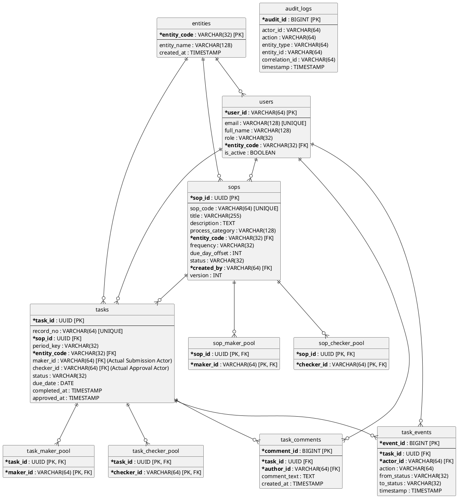

# 📊 FinSOP Enterprise Database Schema & Architecture Guide

## 1. System Overview
FinSOP uses a 100% normalized relational database model designed for multi-entity corporate compliance. The schema cleanly separates **Template Definitions** (`sops`), **Period Execution Instances** (`tasks`), and **Audit / Lifecycle Traceability** (`task_events`, `task_comments`, `audit_logs`).

---

## 2. Complete Mermaid ER Diagram (All 11 Tables)

```mermaid
erDiagram
    entities ||--o{ users : "hosts"
    entities ||--o{ sops : "owns"
    entities ||--o{ tasks : "governs"

    users ||--o{ sops : "created_by"
    users ||--o{ tasks : "actual_maker_actor"
    users ||--o{ tasks : "actual_checker_actor"
    users ||--o{ task_events : "acted_by"
    users ||--o{ task_comments : "authored_by"

    sops ||--o{ sop_maker_pool : "has_eligible_makers"
    sops ||--o{ sop_checker_pool : "has_eligible_checkers"
    sops ||--o{ tasks : "generates_recurring"

    tasks ||--o{ task_maker_pool : "assigned_maker_pool"
    tasks ||--o{ task_checker_pool : "assigned_checker_pool"
    tasks ||--o{ task_events : "audit_history"
    tasks ||--o{ task_comments : "review_notes"

    users ||--o{ sop_maker_pool : "assigned_as_maker"
    users ||--o{ sop_checker_pool : "assigned_as_checker"
    users ||--o{ task_maker_pool : "assigned_as_task_maker"
    users ||--o{ task_checker_pool : "assigned_as_task_checker"

    entities {
        VARCHAR_32 entity_code PK "CK_INDIA | CK_US | CK_UK | CK_AUSTRALIA"
        VARCHAR_128 entity_name "Corporate entity display name"
        TIMESTAMP created_at "Record creation timestamp"
    }

    users {
        VARCHAR_64 user_id PK "Unique user ID (e.g. usr-tushar-304)"
        VARCHAR_128 email "Work email address (UNIQUE)"
        VARCHAR_128 full_name "Full display name"
        VARCHAR_32 role "ADMIN | MAKER | CHECKER | MAKER_CHECKER | VIEWER"
        VARCHAR_32 entity_code FK "FK -> entities.entity_code"
        BOOLEAN is_active "Account status flag"
        TIMESTAMP created_at "Record creation timestamp"
    }

    sops {
        UUID sop_id PK "Primary key identifier"
        VARCHAR_64 sop_code "Business SOP code (e.g. SOP-TAX-IN-001)"
        VARCHAR_255 title "Operational SOP title"
        TEXT description "Filing guidelines & compliance scope"
        VARCHAR_128 process_category "Tax Compliance | Treasury | Payroll"
        VARCHAR_32 entity_code FK "FK -> entities.entity_code"
        VARCHAR_32 frequency "MONTHLY | QUARTERLY | ANNUAL"
        INT due_day_offset "Filing due day of month (e.g. 15th)"
        VARCHAR_32 status "ACTIVE | ARCHIVED"
        VARCHAR_64 created_by FK "FK -> users.user_id (Creator Admin)"
        INT version "Template version counter"
        TIMESTAMP created_at "Creation timestamp"
        TIMESTAMP updated_at "Last update timestamp"
    }

    sop_maker_pool {
        UUID sop_id PK_FK "FK -> sops.sop_id"
        VARCHAR_64 maker_id PK_FK "FK -> users.user_id (Eligible Maker)"
    }

    sop_checker_pool {
        UUID sop_id PK_FK "FK -> sops.sop_id"
        VARCHAR_64 checker_id PK_FK "FK -> users.user_id (Eligible Checker)"
    }

    tasks {
        UUID task_id PK "Primary key identifier"
        VARCHAR_64 record_no "Unique task code (e.g. SOP-TAX-IN-001-2026-08)"
        UUID sop_id FK "FK -> sops.sop_id"
        VARCHAR_32 period_key "Filing period (e.g. 2026-08)"
        VARCHAR_32 entity_code FK "FK -> entities.entity_code"
        VARCHAR_64 maker_id FK "FK -> users.user_id (Actual Submission Actor)"
        VARCHAR_64 checker_id FK "FK -> users.user_id (Actual Approval Actor)"
        VARCHAR_32 status "OPEN | PENDING_REVIEW | APPROVED | REJECTED"
        DATE due_date "Compliance deadline"
        TIMESTAMP completed_at "Submission timestamp"
        TIMESTAMP approved_at "Approval timestamp"
        TIMESTAMP created_at "Task creation timestamp"
        TIMESTAMP updated_at "Last update timestamp"
    }

    task_maker_pool {
        UUID task_id PK_FK "FK -> tasks.task_id"
        VARCHAR_64 maker_id PK_FK "FK -> users.user_id (Assigned Task Maker)"
    }

    task_checker_pool {
        UUID task_id PK_FK "FK -> tasks.task_id"
        VARCHAR_64 checker_id PK_FK "FK -> users.user_id (Assigned Task Checker)"
    }

    task_events {
        BIGINT event_id PK "Auto-increment primary key"
        UUID task_id FK "FK -> tasks.task_id"
        VARCHAR_64 actor_id FK "FK -> users.user_id (Action Performer)"
        VARCHAR_64 action "SUBMIT | APPROVE | REJECT | RESUBMIT"
        VARCHAR_32 from_status "Previous workflow state"
        VARCHAR_32 to_status "New workflow state"
        TIMESTAMP timestamp "Event transition timestamp"
    }

    task_comments {
        BIGINT comment_id PK "Auto-increment primary key"
        UUID task_id FK "FK -> tasks.task_id"
        VARCHAR_64 author_id FK "FK -> users.user_id (Comment Author)"
        TEXT comment_text "Execution notes or rejection reason"
        TIMESTAMP created_at "Comment creation timestamp"
    }

    audit_logs {
        BIGINT audit_id PK "Auto-increment primary key"
        VARCHAR_64 actor_id "User or System Actor ID"
        VARCHAR_64 action "CREATE_SOP | UPDATE_SOP | CREATE_TASK | etc."
        VARCHAR_64 entity_type "SOP | TASK | USER | ENTITY"
        VARCHAR_64 entity_id "Business record identifier"
        VARCHAR_64 correlation_id "End-to-end trace correlation UUID"
        TIMESTAMP timestamp "Audit log timestamp"
    }
```

---

## 3. PlantUML Code for Draw.io (Diagrams.net)



---

## 4. Table-by-Table Breakdown

| Table Name | Primary Key | Foreign Keys | Business Purpose |
| :--- | :--- | :--- | :--- |
| **`entities`** | `entity_code` | None | Corporate entity registry for multi-entity compliance isolation. |
| **`users`** | `user_id` | `entity_code` | User master registry supporting RBAC roles (`ADMIN`, `MAKER`, `CHECKER`, `MAKER_CHECKER`, `VIEWER`). |
| **`sops`** | `sop_id` | `entity_code`, `created_by` | Master SOP template rules, frequency, and offset schedules. |
| **`sop_maker_pool`** | (`sop_id`, `maker_id`) | `sop_id`, `maker_id` | Join collection table storing eligible Makers for an SOP template. |
| **`sop_checker_pool`** | (`sop_id`, `checker_id`) | `sop_id`, `checker_id` | Join collection table storing eligible Checkers for an SOP template. |
| **`tasks`** | `task_id` | `sop_id`, `entity_code`, `maker_id`, `checker_id` | Period compliance task instances. `maker_id` and `checker_id` store actual human action actors. |
| **`task_maker_pool`** | (`task_id`, `maker_id`) | `task_id`, `maker_id` | Join collection table storing assigned Maker pool for a specific task instance. |
| **`task_checker_pool`** | (`task_id`, `checker_id`) | `task_id`, `checker_id` | Join collection table storing assigned Checker pool for a specific task instance. |
| **`task_events`** | `event_id` | `task_id`, `actor_id` | Immutable lifecycle audit timeline recording status transitions. |
| **`task_comments`** | `comment_id` | `task_id`, `author_id` | Review comments and mandatory rejection explanations. |
| **`audit_logs`** | `audit_id` | None | System-wide audit log capturing API actions with correlation tracing. |
