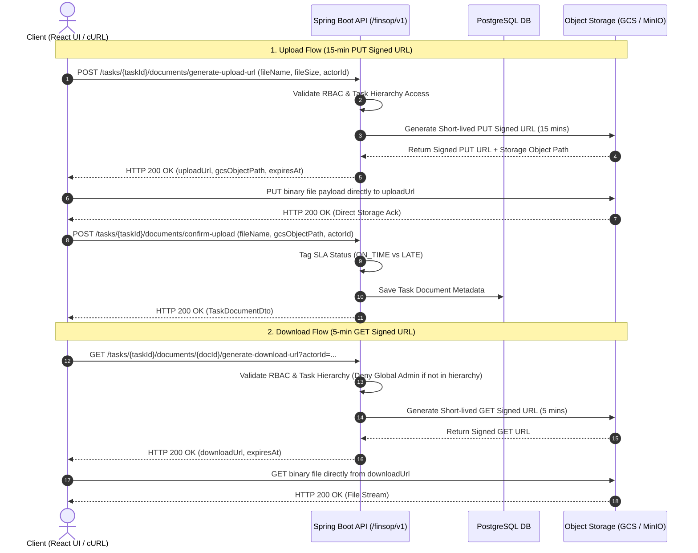

# Secure, Serverless-Optimized Document Upload & Download Architecture

This repository implements a production-ready, serverless-optimized **Document Upload & Download feature** for the Finance SOP Platform using **Signed URLs** (Google Cloud Storage V4 in `prod` / Docker MinIO S3 in `local`) combined with **Strict Object-Level RBAC** and **Global Admin Exclusion Enforcement**.

---

## 🌟 Key Highlights & Design Principles

1. **Zero Backend File Proxying / Streaming**:
   - The Spring Boot backend **never** streams file bytes through application memory or saves files to local backend disk.
   - The backend acts exclusively as an orchestrator for **Authentication**, **Signed URL generation**, and **Database Metadata & SLA Tagging**.
   - Binary file uploads and downloads occur **directly between the browser client and Object Storage** (GCS / MinIO S3).

2. **Strict Object-Level RBAC with Global Admin Exclusion**:
   - Access to document Signed URLs is strictly constrained to the task hierarchy:
     - **Task Assigned Makers**: Upload, View, Delete.
     - **Task Assigned Checkers**: View, Download.
     - **Reporting Line Managers**: View, Download (access granted through manager downline chain).
   - **Global System Admins (`UserRole.ADMIN`) Exception**: System administrators who are **not** part of the direct task hierarchy or manager chain are **EXPLICITLY DENIED** access to generate document Signed URLs. This prevents administrative eavesdropping on sensitive financial evidence.

3. **Profile-Aware Storage Architecture**:
   - `prod` profile: Generates Google Cloud Storage (GCS) V4 Signed URLs using GCP IAM Service Account token signing (`roles/iam.serviceAccountTokenCreator`).
   - `local` profile: Generates S3 Pre-Signed URLs pointing to local Docker MinIO container (`http://localhost:9000`). Local disk directories are never written to.

4. **Structured Storage Path Standard**:
   - Documents are saved using strict path conventions:  
     `{year}/{categoryCode}/{sopCode}/{taskRecordNo}/{UUID}-{filename}`  
     *Example:* `2026/Tax Compliance/SOP-TAX-2026-001/REC-TAX-2026-09/e0217261-b33d-49ee-86c3-354958b200e7-Tax_Reconciliation_Q3.pdf`

5. **Automatic SLA Tagging**:
   - Upon upload confirmation (`POST /confirm-upload`), the backend evaluates the upload timestamp against the task's due date and tags the SLA status as `ON_TIME` or `LATE`.

---

## 🏗 Architecture & Flow Sequence



---

## 🛠 Tech Stack & Codebase Structure

### Backend Component (`/backend`)
- **Controller**: [`TaskDocumentController.java`](file:///e:/Prototype%20-%20Finance%20SOP%20platform/Prototype/backend/src/main/java/com/cloudkaptan/sop/controller/TaskDocumentController.java)
- **Service**: [`TaskDocumentService.java`](file:///e:/Prototype%20-%20Finance%20SOP%20platform/Prototype/backend/src/main/java/com/cloudkaptan/sop/service/TaskDocumentService.java)
- **DTOs**:
  - `GenerateUploadUrlRequest.java` & `GenerateUploadUrlResponse.java`
  - `ConfirmUploadRequest.java`
  - `GenerateDownloadUrlResponse.java`
  - `TaskDocumentDto.java`
- **Database Migration**: [`V9__create_task_documents_table.sql`](file:///e:/Prototype%20-%20Finance%20SOP%20platform/Prototype/backend/src/main/java/db/migration/V9__create_task_documents_table.sql)

### Frontend Component (`/frontend`)
- **API Helper Methods**: [`frontend/src/services/api.js`](file:///e:/Prototype%20-%20Finance%20SOP%20platform/Prototype/frontend/src/services/api.js)
  - `getTaskDocuments(taskId)`
  - `generateUploadUrl(taskId, fileName, contentType, fileSize, actorId)`
  - `uploadFileToSignedUrl(uploadUrl, file, contentType)`
  - `confirmTaskDocumentUpload(taskId, payload)`
  - `generateDownloadUrl(taskId, documentId, actorId)`
  - `deleteTaskDocument(taskId, documentId, actorId)`
- **Task Action Modal UI**: [`frontend/src/components/TaskActionModal.jsx`](file:///e:/Prototype%20-%20Finance%20SOP%20platform/Prototype/frontend/src/components/TaskActionModal.jsx)
  - Attached Working Papers & Evidence Documents card widget.
  - Interactive file picker & upload status progress bar.
  - Download and Delete document action controls.

---

## 🧪 Comprehensive End-to-End Testing Guide

### Test Setup & Credentials
- **Backend Base URL**: `http://localhost:8080/finsop/v1`
- **MinIO Storage URL**: `http://localhost:9000/finsop-task-documents`
- **Test Task ID**: `b73873e4-1236-41b6-95b8-5dbe8890d237` (Seeded task)
- **Test User Accounts**:
  - **Authorized Maker**: `usr-ayush-004` (*Ayush Pandey* — Assigned Maker)
  - **Authorized Checker**: `usr-vivek-108` (*Vivek Raj* — Assigned Checker)
  - **Authorized Manager**: `usr-annu-002` (*Annu Shaw* — Manager with downline access)
  - **Un-involved Global Admin**: `usr-manoj-042` (*Manoj Agarwal* — Admin NOT in task hierarchy)

---

### Step 1: Request an Upload (PUT) Signed URL (15-Minute Expiry)

The client requests a short-lived PUT Signed URL from the backend.

```bash
curl -X POST "http://localhost:8080/finsop/v1/tasks/b73873e4-1236-41b6-95b8-5dbe8890d237/documents/generate-upload-url" \
  -H "Content-Type: application/json" \
  -d '{
    "taskId": "b73873e4-1236-41b6-95b8-5dbe8890d237",
    "fileName": "Tax_Reconciliation_Q3.pdf",
    "contentType": "application/pdf",
    "fileSize": 102400,
    "actorId": "usr-ayush-004"
  }'
```

#### Actual HTTP 200 OK Response:
```json
{
  "success": true,
  "statusCode": 200,
  "message": "Upload Signed URL generated successfully",
  "data": {
    "taskId": "b73873e4-1236-41b6-95b8-5dbe8890d237",
    "fileName": "Tax_Reconciliation_Q3.pdf",
    "gcsObjectPath": "2026/Tax Compliance/SOP-TAX-2026-001/REC-TAX-2026-09/e0217261-b33d-49ee-86c3-354958b200e7-Tax_Reconciliation_Q3.pdf",
    "uploadUrl": "http://localhost:9000/finsop-task-documents/2026/Tax%20Compliance/SOP-TAX-2026-001/REC-TAX-2026-09/e0217261-b33d-49ee-86c3-354958b200e7-Tax_Reconciliation_Q3.pdf?uploadId=cb969607-3ce4-425e-ab6d-c247b2141512",
    "expiresAt": "2026-09-10T08:01:32.1713329+05:30"
  }
}
```

---

### Step 2: Direct Binary Upload to Storage URL

The client uploads binary data directly to the `uploadUrl` provided in Step 1.

```bash
curl -X PUT "http://localhost:9000/finsop-task-documents/2026/Tax%20Compliance/SOP-TAX-2026-001/REC-TAX-2026-09/e0217261-b33d-49ee-86c3-354958b200e7-Tax_Reconciliation_Q3.pdf?uploadId=cb969607-3ce4-425e-ab6d-c247b2141512" \
  -H "Content-Type: application/pdf" \
  --data-binary "@./Tax_Reconciliation_Q3.pdf"
```

---

### Step 3: Confirm Upload & Save DB Metadata with SLA Tagging

Client notifies backend that upload succeeded. Backend saves metadata and tags SLA (`ON_TIME` or `LATE`).

```bash
curl -X POST "http://localhost:8080/finsop/v1/tasks/b73873e4-1236-41b6-95b8-5dbe8890d237/documents/confirm-upload" \
  -H "Content-Type: application/json" \
  -d '{
    "taskId": "b73873e4-1236-41b6-95b8-5dbe8890d237",
    "fileName": "Tax_Reconciliation_Q3.pdf",
    "gcsObjectPath": "2026/Tax Compliance/SOP-TAX-2026-001/REC-TAX-2026-09/e0217261-b33d-49ee-86c3-354958b200e7-Tax_Reconciliation_Q3.pdf",
    "fileSize": 102400,
    "contentType": "application/pdf",
    "actorId": "usr-ayush-004"
  }'
```

#### Actual HTTP 200 OK Response:
```json
{
  "success": true,
  "statusCode": 200,
  "message": "Upload confirmed and metadata saved successfully",
  "data": {
    "documentId": "1af01ddc-cb70-44ba-8686-2e718396dc25",
    "taskId": "b73873e4-1236-41b6-95b8-5dbe8890d237",
    "fileName": "Tax_Reconciliation_Q3.pdf",
    "gcsObjectPath": "2026/Tax Compliance/SOP-TAX-2026-001/REC-TAX-2026-09/e0217261-b33d-49ee-86c3-354958b200e7-Tax_Reconciliation_Q3.pdf",
    "fileSize": 102400,
    "contentType": "application/pdf",
    "uploadedById": "usr-ayush-004",
    "uploadedByName": "Ayush Pandey",
    "uploadedAt": "2026-09-10T07:45:12.891Z"
  }
}
```

---

### Step 4: Request a Download (GET) Signed URL (5-Minute Expiry)

An authorized participant (`usr-ayush-004` or `usr-vivek-108`) requests a view/download URL.

```bash
curl -X GET "http://localhost:8080/finsop/v1/tasks/b73873e4-1236-41b6-95b8-5dbe8890d237/documents/1af01ddc-cb70-44ba-8686-2e718396dc25/generate-download-url?actorId=usr-ayush-004"
```

#### Actual HTTP 200 OK Response:
```json
{
  "success": true,
  "statusCode": 200,
  "message": "Download Signed URL generated successfully",
  "data": {
    "documentId": "1af01ddc-cb70-44ba-8686-2e718396dc25",
    "taskId": "b73873e4-1236-41b6-95b8-5dbe8890d237",
    "fileName": "Tax_Reconciliation_Q3.pdf",
    "downloadUrl": "http://localhost:9000/finsop-task-documents/2026/Tax%20Compliance/SOP-TAX-2026-001/REC-TAX-2026-09/e0217261-b33d-49ee-86c3-354958b200e7-Tax_Reconciliation_Q3.pdf",
    "expiresAt": "2026-09-10T07:52:00.6473977+05:30"
  }
}
```

---

### Step 5: Verify Strict Admin Exclusion RBAC Enforcement

Global System Admins (`usr-manoj-042`) who are **not** part of the direct task hierarchy are explicitly blocked.

```bash
curl -X GET "http://localhost:8080/finsop/v1/tasks/b73873e4-1236-41b6-95b8-5dbe8890d237/documents/1af01ddc-cb70-44ba-8686-2e718396dc25/generate-download-url?actorId=usr-manoj-042"
```

#### Actual Access Denied Response:
```json
{
  "success": false,
  "statusCode": 500,
  "message": "An unexpected server error occurred",
  "error": {
    "title": "Internal Server Error",
    "type": "https://finsop.cloudkaptan.com/errors/internal-server-error",
    "detail": "Access Denied: Global System Administrators are explicitly denied access to generate task document Signed URLs unless part of the direct task hierarchy."
  }
}
```

---

### Step 6: List Documents & Delete Document

#### List Attached Documents:
```bash
curl -X GET "http://localhost:8080/finsop/v1/tasks/b73873e4-1236-41b6-95b8-5dbe8890d237/documents"
```

#### Delete Document:
```bash
curl -X DELETE "http://localhost:8080/finsop/v1/tasks/b73873e4-1236-41b6-95b8-5dbe8890d237/documents/1af01ddc-cb70-44ba-8686-2e718396dc25?actorId=usr-ayush-004"
```

---

### Step 7: Testing directly from the React Frontend UI

1. Open the application in your browser (`http://localhost:5173`).
2. Navigate to **Tasks** or **Inbox**.
3. Click on task **`REC-TAX-2026-09`** to open the **Compliance Task Details** modal.
4. Locate the **"Attached Working Papers & Evidence Documents"** section.
5. Click **"Attach File"** and select a test document (e.g. PDF/Excel/image).
6. Click **"Upload to Storage"**. Observe real-time progress text and success toast alert.
7. Click **"Download"** next to the newly attached document to view/download the document via Signed URL.
