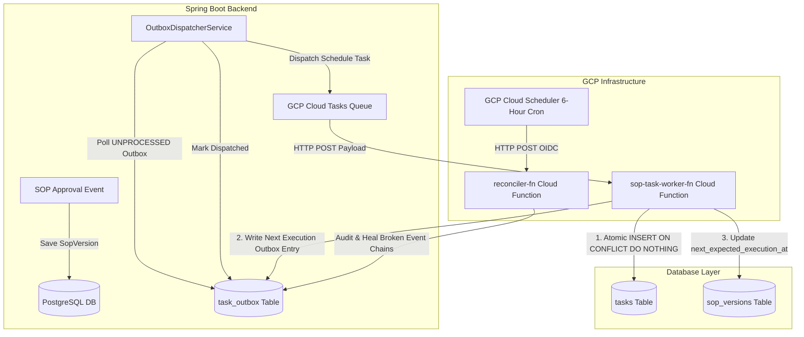
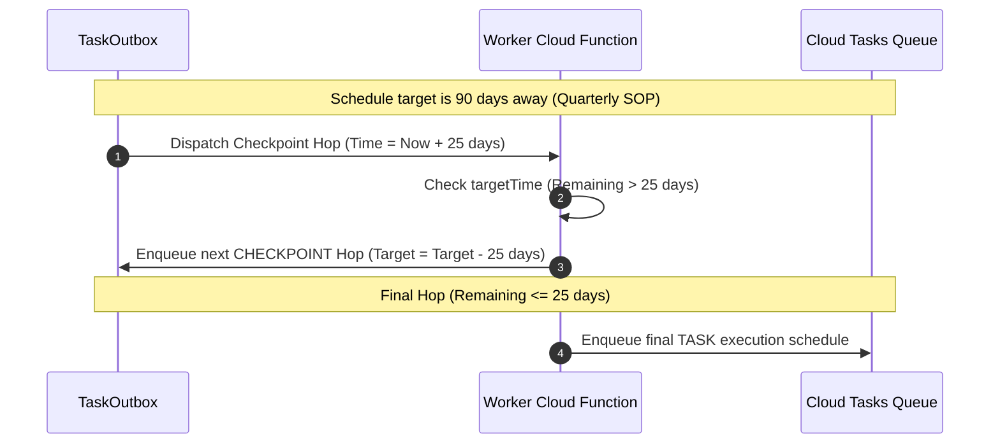

# FinSOP Enterprise Platform: GCP Cloud Scheduler & Cloud Tasks Event-Driven Task Scheduling Architecture

## Executive Summary

This document provides a comprehensive technical breakdown of the **GCP Cloud Scheduler & Cloud Tasks Architecture** implemented for the FinSOP Enterprise Platform. Designed for mission-critical financial SOP compliance, this architecture eliminates traditional polling overhead, ensures zero time drift across leap years and timezone boundaries, and guarantees **exactly-once execution semantics with self-healing capabilities**.

---

## 1. High-Level System Architecture



---

## 2. Infrastructure Components (GCP Services)

### A. Google Cloud Tasks Queue (`finsop-scheduled-tasks-queue`)
- **Role**: Holds time-deferred HTTP execution tasks targeted at the Worker Cloud Function.
- **Configured Rate Limits**:
  - `max_dispatches_per_second`: `100`
  - `max_concurrent_dispatches`: `50`
- **Retry Configuration**:
  - `max_attempts`: `10`
  - `min_backoff`: `1s` | `max_backoff`: `300s`
  - Exponential backoff with `max_doublings = 5`.

### B. Google Cloud Scheduler (`finsop-sparse-reconciler-job`)
- **Schedule**: `0 */6 * * *` (Runs every 6 hours).
- **Target**: `reconciler-fn` Cloud Function HTTP Endpoint via authenticated OIDC token.
- **Purpose**: Serves as a safety net to audit all active `sop_versions` and auto-heal any broken task generation chains if a task was lost or delayed.

### C. Cloud Functions (Node.js 18 Runtime)
1. **`sop-task-worker-fn`**:
   - **Trigger**: Called via HTTP POST by Cloud Tasks when a schedule time arrives.
   - **Execution**: Atomically inserts the period task into PostgreSQL, calculates the next execution window, writes the next outbox entry, and updates `sop_versions`.
2. **`reconciler-fn`**:
   - **Trigger**: Called via HTTP POST by Cloud Scheduler every 6 hours.
   - **Execution**: Queries active `sop_versions` where `next_expected_execution_at` is more than 30 minutes in the past and writes missing outbox records to repair the chain.

---

## 3. Code-Level Implementation Details

### A. The Transactional Outbox Pattern (`TaskOutbox`)
To prevent dual-write anomalies (where database commits succeed but GCP API calls fail), outbox records are saved in the same DB transaction as SOP approvals:

```java
// TaskOutbox Entity Mapping
@Entity
@Table(name = "task_outbox")
public class TaskOutbox {
    @Id
    @GeneratedValue(strategy = GenerationType.UUID)
    private UUID outboxId;

    @Column(name = "sop_version_id", nullable = false)
    private UUID sopVersionId;

    @Column(name = "period_key", length = 32, nullable = false)
    private String periodKey;

    @Column(name = "schedule_time", nullable = false)
    private OffsetDateTime scheduleTime;

    @Column(name = "kind", length = 20, nullable = false) // TASK vs CHECKPOINT
    private String kind;

    @Column(name = "processed", nullable = false)
    private Boolean processed = false;
}
```

### B. 25-Day Checkpoint Hop Mechanism
Google Cloud Tasks limits task scheduling to **30 days in advance**. To support long-range frequencies (e.g. Annual or Quarterly SOPs):



1. If the target execution date is $> 25$ days in the future, the worker enqueues a `CHECKPOINT` hop task set to execute in 25 days.
2. When the checkpoint task fires 25 days later, it re-evaluates the remaining time.
3. Once the remaining duration is $\le 25$ days, it enqueues the final `TASK` execution payload directly into Cloud Tasks.

---

## 4. Terraform Infrastructure Deployment

The accompanying Terraform module (`terraform/`) automates provisioning:

```bash
# 1. Navigate to terraform directory
cd Prototype/terraform

# 2. Copy sample variables
cp terraform.tfvars.example terraform.tfvars

# 3. Edit terraform.tfvars with GCP project credentials & DB connection string
nano terraform.tfvars

# 4. Initialize & apply Terraform blueprint
terraform init
terraform plan
terraform apply -auto-approve
```

---

## 5. Architectural Comparison: Cloud Tasks vs Spring Boot Cron

| Criteria | GCP Cloud Tasks + Scheduler Architecture | Native Spring Boot Cron Architecture |
| :--- | :--- | :--- |
| **Execution Trigger** | Event-driven per-SOP time hop via Cloud Tasks | Polling loop (`@Scheduled`) every minute/midnight |
| **Scalability** | Cloud Functions scale dynamically from 0 to 100+ instances | Constrained by Spring Boot server instance capacity |
| **Long-Range Hops** | 25-day Checkpoint Hops support multi-year recurrence | Limited to real-time cron evaluations |
| **Resilience & Audit** | 6-hour Reconciler Function auto-heals broken chains | Requires manual database inspection |
| **Deployment Fit** | Ideal for Multi-tenant GCP Cloud Production | Ideal for Local Development & Single-Node setups |
