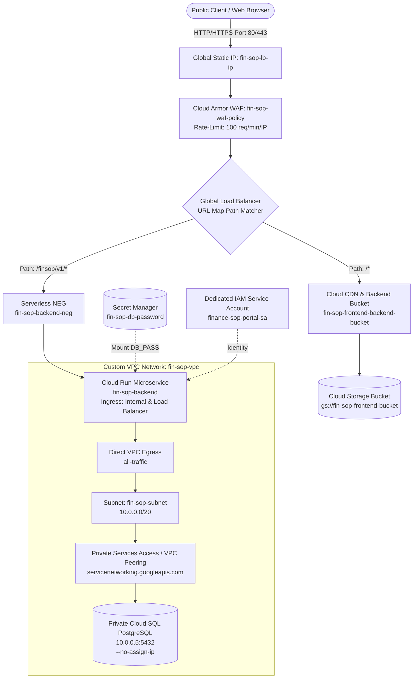

# FinSOP Portal - Complete GCP Production Deployment Guide

This document provides a comprehensive, command-by-command technical explanation for deploying the **FinSOP Portal** on **Google Cloud Platform (GCP)**. 

---

## 🏗️ Architectural Topology Overview



---

## 📋 Environment Prerequisites & Setup

Run these export commands in your shell session. They define environment parameters referenced throughout all deployment phases.

```bash
export PROJECT_ID="finance-sop-portal"
export REGION="asia-south1"
export BUCKET_NAME="fin-sop-frontend-bucket"
export DOMAIN_NAME="finsop.cloudkaptan.com"
```

---

## Phase 1: Networking & Private Database Infrastructure

### 1. Create Custom VPC Network
```bash
gcloud compute networks create fin-sop-vpc --subnet-mode=custom
```
* **Why it is used**: Creates an isolated Virtual Private Cloud (VPC) network named `fin-sop-vpc`.
* **Parameter Breakdown**:
  * `--subnet-mode=custom`: Disables auto-creation of default subnets across all GCP regions. Custom subnetting enforces strict IP address management and zero-trust perimeter control.

### 2. Create Private Subnet
```bash
gcloud compute networks subnets create fin-sop-subnet \
    --network=fin-sop-vpc \
    --range=10.0.0.0/20 \
    --region=$REGION
```
* **Why it is used**: Provisions a dedicated subnet inside `fin-sop-vpc` located in `asia-south1` (Mumbai).
* **Parameter Breakdown**:
  * `--range=10.0.0.0/20`: Allocates 4,096 IP addresses (`10.0.0.1` to `10.0.15.254`), providing IP space for Serverless VPC Access and internal compute resources.

### 3. Allocate Private IP Range for Service Networking
```bash
gcloud compute addresses create fin-sop-db-ip-range \
    --global \
    --purpose=VPC_PEERING \
    --prefix-length=24 \
    --description="For Cloud SQL" \
    --network=fin-sop-vpc
```
* **Why it is used**: Reserves a block of internal IPv4 addresses within the VPC dedicated exclusively to Google-managed services (Cloud SQL).
* **Parameter Breakdown**:
  * `--global`: Internal VPC Peering range allocations are global resources in GCP.
  * `--purpose=VPC_PEERING`: Marks this address block specifically for Private Services Connection (Service Networking).
  * `--prefix-length=24`: Allocates a `/24` subnet (256 private IP addresses).

### 4. Create Private Services Access Connection (VPC Peering)
```bash
gcloud services vpc-peerings connect \
    --service=servicenetworking.googleapis.com \
    --ranges=fin-sop-db-ip-range \
    --network=fin-sop-vpc
```
* **Why it is used**: Establishes a private VPC Peering link between `fin-sop-vpc` and Google’s internal tenant project where Cloud SQL instances reside.
* **Security Impact**: Allows backend services in your VPC to communicate with PostgreSQL using private internal IPs without traversing the public internet.

### 5. Store Database Password in Secret Manager
```bash
printf "YOUR_DB_PASSWORD" | gcloud secrets create fin-sop-db-password --data-file=-
```
* **Why it is used**: Securely stores the PostgreSQL database password in GCP Secret Manager instead of hardcoding credentials in deployment scripts or environment files.
* **Parameter Breakdown**:
  * `--data-file=-`: Reads the secret payload directly from stdin pipe (`printf`).

### 6. Create Private Cloud SQL PostgreSQL Instance
```bash
gcloud sql instances create fin-sop-postgres \
    --database-version=POSTGRES_15 \
    --cpu=1 \
    --memory=4GB \
    --region=$REGION \
    --network=fin-sop-vpc \
    --no-assign-ip
```
* **Why it is used**: Provisions a fully managed PostgreSQL 15 database instance.
* **Parameter Breakdown**:
  * `--network=fin-sop-vpc`: Attaches the database directly to your custom VPC via the Private Services Access peering created in Step 4.
  * `--no-assign-ip`: **CRITICAL SECURITY RULE**. Disables public IPv4 address assignment. The database is completely unreachable from the public internet.

### 7. Create Logical Application Database
```bash
gcloud sql databases create fin_sop_db --instance=fin-sop-postgres
```
* **Why it is used**: Creates the logical database `fin_sop_db` inside the `fin-sop-postgres` instance for the Spring Boot application tables.

### 8. Create Application User Account
```bash
gcloud sql users create sop_app_user \
    --instance=fin-sop-postgres \
    --password="YOUR_DB_PASSWORD"
```
* **Why it is used**: Creates dedicated database user credentials (`sop_app_user`) used by Spring Boot to execute schema initialization and DML queries.

---

## Phase 2: Backend Container & Cloud Run Microservice

### 1. Create Dedicated Service Account
```bash
gcloud iam service-accounts create finance-sop-portal-sa \
    --display-name="FinSOP Backend Service Account"
```
* **Why it is used**: Adheres to the **Principle of Least Privilege** by creating a dedicated IAM identity for the backend service rather than using the default Compute service account.

### 2. Grant Secret Access Permission
```bash
gcloud secrets add-iam-policy-binding fin-sop-db-password \
    --member="serviceAccount:finance-sop-portal-sa@${PROJECT_ID}.iam.gserviceaccount.com" \
    --role="roles/secretmanager.secretAccessor"
```
* **Why it is used**: Authorizes the backend service account to read and fetch the `fin-sop-db-password` secret at container startup.

### 3. Create Artifact Registry Container Repository
```bash
gcloud artifacts repositories create fin-sop-repo \
    --repository-format=docker \
    --location=$REGION
```
* **Why it is used**: Creates a secure, private Docker registry repository in Artifact Registry (`asia-south1`) to store container images.

### 4. Build & Push Docker Image via Cloud Build
```bash
gcloud builds submit --tag ${REGION}-docker.pkg.dev/${PROJECT_ID}/fin-sop-repo/fin-sop-backend
```
* **Why it is used**: Compiles the Spring Boot backend source code inside Google Cloud Build, builds a production Docker image, and pushes it directly into Artifact Registry.

### 5. Deploy Backend Microservice to Cloud Run
```bash
gcloud run deploy fin-sop-backend \
    --image=${REGION}-docker.pkg.dev/${PROJECT_ID}/fin-sop-repo/fin-sop-backend \
    --region=$REGION \
    --service-account=finance-sop-portal-sa@${PROJECT_ID}.iam.gserviceaccount.com \
    --network=fin-sop-vpc \
    --subnet=fin-sop-subnet \
    --vpc-egress=all-traffic \
    --ingress=internal-and-cloud-load-balancing \
    --no-allow-unauthenticated \
    --set-env-vars=DB_HOST=10.0.0.5,DB_PORT=5432,DB_NAME=fin_sop_db,DB_USER=sop_app_user \
    --set-secrets=DB_PASS=fin-sop-db-password:latest
```
* **Why it is used**: Deploys the containerized Spring Boot application onto Cloud Run serverless compute with enterprise network isolation.
* **Parameter Breakdown**:
  * `--vpc-egress=all-traffic`: Routes **all outbound network requests** from Cloud Run through the VPC subnet, allowing it to reach the private Cloud SQL instance IP (`10.0.0.5`).
  * `--ingress=internal-and-cloud-load-balancing`: **CRITICAL SECURITY RULE**. Blocks direct access to the `*.run.app` URL from the public internet. Requests are accepted *only* via the Global Load Balancer.
  * `--no-allow-unauthenticated`: Forces IAM authentication checks unless explicitly granted.
  * `--set-secrets=DB_PASS=fin-sop-db-password:latest`: Automatically injects the Secret Manager database password into the container environment variable `DB_PASS` at runtime.

---

## Phase 3: Frontend Deployment (Google Cloud Storage)

### 1. Create Public GCS Bucket for Static Assets
```bash
gcloud storage buckets create gs://$BUCKET_NAME --location=$REGION
```
* **Why it is used**: Creates a Cloud Storage bucket `gs://fin-sop-frontend-bucket` to host built React single-page application (SPA) static files (HTML, CSS, JS, media).

### 2. Configure IAM Access Policy for Bucket
```bash
gcloud storage buckets add-iam-policy-binding gs://$BUCKET_NAME \
    --member="allUsers" \
    --role="roles/storage.objectViewer"
```
* **Why it is used**: Grants public read access (`roles/storage.objectViewer`) to all objects in the bucket, allowing Cloud CDN and Load Balancer backend buckets to serve web pages to end users.

### 3. Build & Sync React Assets
```bash
npm install
npm run build
gcloud storage cp -r dist/* gs://$BUCKET_NAME/
```
* **Why it is used**: Compiles React JS/CSS bundles using Vite production build (`dist/`) and uploads static assets into the Cloud Storage bucket root directory.

---

## Phase 4: Cloud Armor WAF & Global Load Balancer Setup

### 1. Create Cloud Armor Security Policy (WAF)
```bash
gcloud compute security-policies create fin-sop-waf-policy \
    --description="WAF security policy for FinSOP Portal"
```
* **Why it is used**: Initializes a Cloud Armor Web Application Firewall (WAF) policy container to defend against DDoS attacks, SQL injection, and web abuse.

### 2. Configure Rate-Limiting Ban Rule
```bash
gcloud compute security-policies rules create 1000 \
    --security-policy=fin-sop-waf-policy \
    --expression="true" \
    --action="rate-based-ban" \
    --rate-limit-threshold-count=100 \
    --rate-limit-threshold-interval-sec=60 \
    --ban-duration-sec=300 \
    --conform-action="allow" \
    --exceed-action="deny-429" \
    --enforce-on-key="IP"
```
* **Why it is used**: Enforces DDoS and brute-force protection.
* **Rule Logic**: If any single client IP address exceeds **100 HTTP requests per 60 seconds**, Cloud Armor issues a **5-minute (300s) IP ban**, returning HTTP `429 Too Many Requests`.

### 3. Create Serverless Network Endpoint Group (NEG)
```bash
gcloud compute network-endpoint-groups create fin-sop-backend-neg \
    --region=$REGION \
    --network-endpoint-type=serverless \
    --cloud-run-service=fin-sop-backend
```
* **Why it is used**: Connects the Global Load Balancer to the Cloud Run serverless backend microservice.

### 4. Create Global Backend Service & Attach WAF
```bash
gcloud compute backend-services create fin-sop-backend-service \
    --global \
    --load-balancing-scheme=EXTERNAL_MANAGED

gcloud compute backend-services update fin-sop-backend-service \
    --global \
    --security-policy=fin-sop-waf-policy

gcloud compute backend-services add-backend fin-sop-backend-service \
    --global \
    --network-endpoint-group=fin-sop-backend-neg \
    --network-endpoint-group-region=$REGION
```
* **Why it is used**: Creates a Global Backend Service, attaches the Cloud Armor WAF policy (`fin-sop-waf-policy`) to inspect incoming traffic, and binds the Serverless NEG as the target compute destination.

### 5. Create Backend Bucket & Enable Cloud CDN
```bash
gcloud compute backend-buckets create fin-sop-frontend-backend-bucket \
    --gcs-bucket-name=$BUCKET_NAME \
    --enable-cdn
```
* **Why it is used**: Wraps the GCS frontend bucket into a Global Load Balancer backend object and enables **Google Cloud CDN** for low-latency edge caching of static web resources worldwide.

### 6. Configure Path-Based Routing (URL Map)
```bash
gcloud compute url-maps create fin-sop-load-balancer \
    --default-backend-bucket=fin-sop-frontend-backend-bucket

gcloud compute url-maps add-path-matcher fin-sop-load-balancer \
    --path-matcher-name=api-matcher \
    --default-backend-bucket=fin-sop-frontend-backend-bucket \
    --backend-service-path-rules="/finsop/v1/*=fin-sop-backend-service"
```
* **Why it is used**: Implements path-based routing at the HTTP Load Balancer level:
  * Default Path (`/*`): Routes to Cloud CDN + GCS Bucket (React SPA Frontend).
  * API Path (`/finsop/v1/*`): Routes to Cloud Run Microservice (`fin-sop-backend-service`).

### 7. Reserve Global Static IP Address
```bash
gcloud compute addresses create fin-sop-lb-ip --global
```
* **Why it is used**: Reserves a dedicated, fixed global IPv4 address for the Load Balancer so DNS records (`finsop.cloudkaptan.com`) remain permanent.

### 8. Configure Target HTTP Proxy & Port 80 Forwarding Rule
```bash
gcloud compute target-http-proxies create fin-sop-http-proxy \
    --url-map=fin-sop-load-balancer

gcloud compute forwarding-rules create fin-sop-http-forwarding-rule \
    --global \
    --target-http-proxy=fin-sop-http-proxy \
    --ports=80 \
    --address=fin-sop-lb-ip
```
* **Why it is used**: Binds the static IP address on Port 80 (HTTP) to the Target HTTP Proxy and URL Map, routing public traffic into the application.

### 9. Grant Load Balancer Invoker Rights to Cloud Run
```bash
gcloud run services add-iam-policy-binding fin-sop-backend \
    --region=$REGION \
    --member="allUsers" \
    --role="roles/run.invoker"
```
* **Why it is used**: Allows the Load Balancer to invoke Cloud Run endpoints while ingress remains strictly restricted (`internal-and-cloud-load-balancing`).

---

## Phase 5: Custom Domain & Managed HTTPS Setup

### 1. Provision Managed SSL/TLS Certificate
```bash
gcloud compute ssl-certificates create fin-sop-ssl-cert \
    --domains=$DOMAIN_NAME \
    --global
```
* **Why it is used**: Requests an automated, Google-managed SSL/TLS certificate for `finsop.cloudkaptan.com` with auto-renewal.

### 2. Create Target HTTPS Proxy
```bash
gcloud compute target-https-proxies create fin-sop-https-proxy \
    --url-map=fin-sop-load-balancer \
    --ssl-certificates=fin-sop-ssl-cert \
    --global
```
* **Why it is used**: Connects the Google-managed SSL certificate to the Load Balancer URL map to enable encrypted HTTPS traffic.

### 3. Create Port 443 (HTTPS) Forwarding Rule
```bash
gcloud compute forwarding-rules create fin-sop-https-forwarding-rule \
    --global \
    --target-https-proxy=fin-sop-https-proxy \
    --ports=443 \
    --address=fin-sop-lb-ip
```
* **Why it is used**: Opens Port 443 (HTTPS) on the global static IP (`fin-sop-lb-ip`), enabling secure, encrypted SSL communication for end users.

---

## 🔒 Security Summary Matrix

| Security Layer | Infrastructure Component | Technical Control Implemented |
| :--- | :--- | :--- |
| **WAF / Edge Protection** | Cloud Armor Security Policy | Rate limiting (100 req/min/IP), DDoS ban mitigation |
| **Edge Content Delivery** | Cloud CDN | Cached static asset delivery, reduced origin load |
| **Ingress Lockdown** | Cloud Run Ingress Settings | Direct `*.run.app` URLs disabled (`internal-and-cloud-load-balancing`) |
| **Database Isolation** | Private Cloud SQL | Public IP removed (`--no-assign-ip`), reachable only via VPC Peering |
| **Data At Rest Secrets** | Secret Manager | DB passwords encrypted & injected directly via IAM Service Account |
| **Identity & Access** | IAM Dedicated Service Account | Principle of Least Privilege enforcement |
