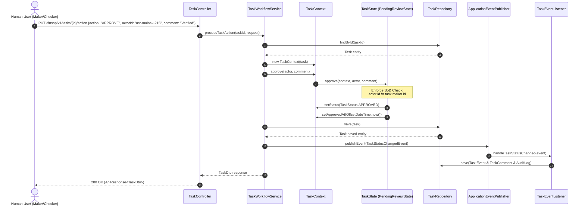
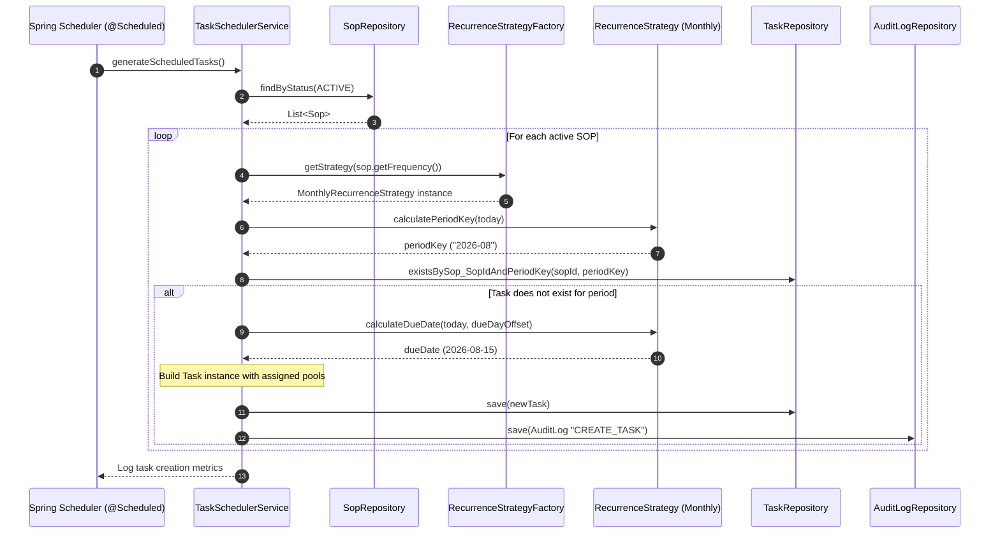
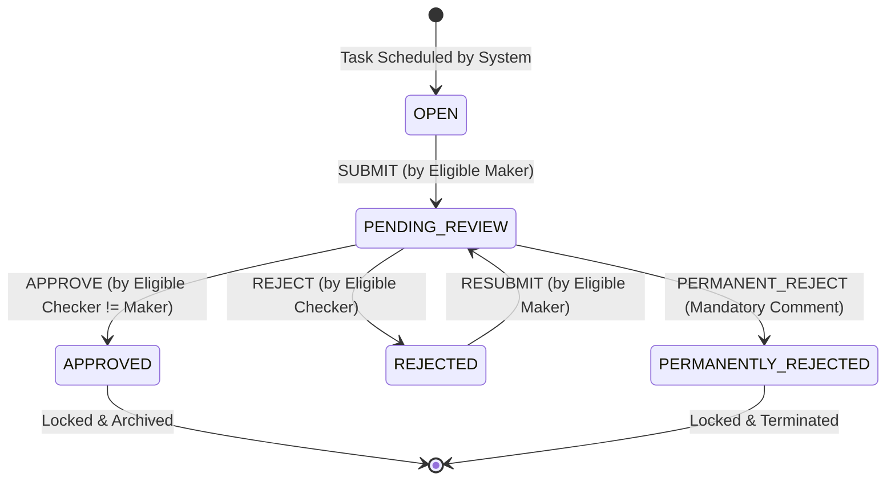

# 🏗️ FinSOP Platform - Low-Level Design (LLD) Architecture Document

## 1. System Design Overview
The FinSOP backend is built as a highly robust **Modular Monolith** using **Spring Boot 3.3.4 (Java 17)**. 

### Key Architectural Patterns Implemented:
* **State Design Pattern**: Enforces strict task lifecycle workflow state transitions (`OPEN` $\rightarrow$ `PENDING_REVIEW` $\rightarrow$ `APPROVED` / `REJECTED` / `PERMANENTLY_REJECTED`).
* **Strategy Design Pattern**: Handles multi-frequency compliance recurrence logic (`MONTHLY`, `QUARTERLY`, `ANNUAL`).
* **Event-Driven Architecture (EDA)**: Decouples task status transitions from audit logging and notification events via Spring `ApplicationEventPublisher`.
* **Repository Pattern**: Abstrates database access with Spring Data JPA queries and projection DTOs.
* **Segregation of Duties (SoD) Engine**: Programmatically enforces Maker-Checker independence (preventing self-approval).

---

## 2. Complete Object-Oriented Class Diagram (LLD)

```mermaid
classDiagram
    %% REST Controllers
    class TaskController {
        -TaskWorkflowService taskWorkflowService
        -TaskSchedulerService taskSchedulerService
        +getTasks(entities) ResponseEntity
        +getInboxTasks(entities, status, userId, pageable) ResponseEntity
        +getTaskById(id) ResponseEntity
        +executeTaskAction(id, request) ResponseEntity
        +deleteTask(id) ResponseEntity
        +generateScheduledTasks() ResponseEntity
    }

    class SopController {
        -SopService sopService
        +getSops(entities) ResponseEntity
        +getSopById(id) ResponseEntity
        +createSop(request) ResponseEntity
        +updateSop(id, request) ResponseEntity
        +deleteSop(id) ResponseEntity
    }

    class DashboardController {
        -DashboardService dashboardService
        +getSummary(entities, userId) ResponseEntity
    }

    %% Service Layer
    class TaskWorkflowService {
        -TaskRepository taskRepository
        -UserRepository userRepository
        -ApplicationEventPublisher eventPublisher
        -AuditLogRepository auditLogRepository
        -TaskEventRepository taskEventRepository
        -TaskCommentRepository taskCommentRepository
        +processTaskAction(taskId, request) TaskDto
        +submitTask(taskId, actorId, comment) TaskDto
        +approveTask(taskId, actorId, comment) TaskDto
        +rejectTask(taskId, actorId, comment, isPermanent) TaskDto
        +getTaskById(taskId) TaskDto
        +mapToDto(task) TaskDto
    }

    class SopService {
        -SopRepository sopRepository
        -UserRepository userRepository
        -CorporateEntityRepository entityRepository
        -TaskSchedulerService taskSchedulerService
        -AuditLogRepository auditLogRepository
        +getSops(entities) List~SopDto~
        +createSop(request) SopDto
        +updateSop(id, request) SopDto
        +deleteSop(id) void
        +mapToDto(sop) SopDto
    }

    class TaskSchedulerService {
        -SopRepository sopRepository
        -TaskRepository taskRepository
        -RecurrenceStrategyFactory strategyFactory
        -AuditLogRepository auditLogRepository
        +generateScheduledTasks() void
    }

    class DashboardService {
        -TaskRepository taskRepository
        -UserRepository userRepository
        -CorporateEntityRepository entityRepository
        -TaskWorkflowService taskWorkflowService
        +getDashboardSummary(entities, userId) DashboardSummaryDto
    }

    %% State Pattern (Task Workflow Engine)
    class TaskContext {
        -Task task
        -TaskState currentState
        +submit(actor, comment) void
        +approve(actor, comment) void
        +reject(actor, comment) void
    }

    class TaskState {
        <<interface>>
        +submit(context, actor, comment) void
        +approve(context, actor, comment) void
        +reject(context, actor, comment) void
    }

    class OpenState {
        +submit(context, actor, comment) void
        +approve(context, actor, comment) void
        +reject(context, actor, comment) void
    }

    class PendingReviewState {
        +submit(context, actor, comment) void
        +approve(context, actor, comment) void
        +reject(context, actor, comment) void
    }

    class ApprovedState {
        +submit(context, actor, comment) void
        +approve(context, actor, comment) void
        +reject(context, actor, comment) void
    }

    class RejectedState {
        +submit(context, actor, comment) void
        +approve(context, actor, comment) void
        +reject(context, actor, comment) void
    }

    %% Strategy Pattern (Recurrence Engine)
    class RecurrenceStrategyFactory {
        -Map~SopFrequency, RecurrenceStrategy~ strategies
        +getStrategy(frequency) RecurrenceStrategy
    }

    class RecurrenceStrategy {
        <<interface>>
        +calculatePeriodKey(date) String
        +calculateDueDate(date, dueDayOffset) LocalDate
    }

    class MonthlyRecurrenceStrategy {
        +calculatePeriodKey(date) String
        +calculateDueDate(date, dueDayOffset) LocalDate
    }

    class QuarterlyRecurrenceStrategy {
        +calculatePeriodKey(date) String
        +calculateDueDate(date, dueDayOffset) LocalDate
    }

    class AnnualRecurrenceStrategy {
        +calculatePeriodKey(date) String
        +calculateDueDate(date, dueDayOffset) LocalDate
    }

    %% Event Driven Architecture
    class TaskStatusChangedEvent {
        -Task task
        -User actor
        -TaskStatus fromStatus
        -TaskStatus toStatus
        -String action
        -String comment
    }

    class TaskEventListener {
        -TaskEventRepository taskEventRepository
        -TaskCommentRepository taskCommentRepository
        -AuditLogRepository auditLogRepository
        +handleTaskStatusChanged(event) void
    }

    %% Relationships
    TaskController --> TaskWorkflowService
    TaskController --> TaskSchedulerService
    SopController --> SopService
    DashboardController --> DashboardService

    TaskWorkflowService --> TaskContext
    TaskContext --> TaskState
    TaskState <|.. OpenState
    TaskState <|.. PendingReviewState
    TaskState <|.. ApprovedState
    TaskState <|.. RejectedState

    TaskSchedulerService --> RecurrenceStrategyFactory
    RecurrenceStrategyFactory --> RecurrenceStrategy
    RecurrenceStrategy <|.. MonthlyRecurrenceStrategy
    RecurrenceStrategy <|.. QuarterlyRecurrenceStrategy
    RecurrenceStrategy <|.. AnnualRecurrenceStrategy

    TaskWorkflowService ..> TaskStatusChangedEvent : publishes
    TaskEventListener ..> TaskStatusChangedEvent : consumes
```

---

## 3. Sequence Diagrams (Component Level Interactions)

### 3.1 Task Execution Sequence (`PUT /finsop/v1/tasks/{id}/action`)

---

### 3.2 Automated Recurrence Engine Sequence (Scheduled Cron Task)

---

## 4. Architectural Component Deep Dive

### 4.1 Workflow State Pattern Breakdown
The state pattern encapsulates all valid lifecycle transitions and business logic constraints:

### 4.2 Segregation of Duties (SoD) Guardrails
1. **Self-Approval Lock**: When `TaskState.approve()` is invoked, the system verifies `!task.getMaker().getUserId().equals(actor.getUserId())`. If identical, it throws an `IllegalStateException("Segregation of Duties Violation: Maker cannot approve their own submission")`.
2. **Double Action Lock**: Once a task transitions to `APPROVED` or `PERMANENTLY_REJECTED`, the state class throws an `IllegalStateException("Task is locked and cannot undergo further state transitions")`.
