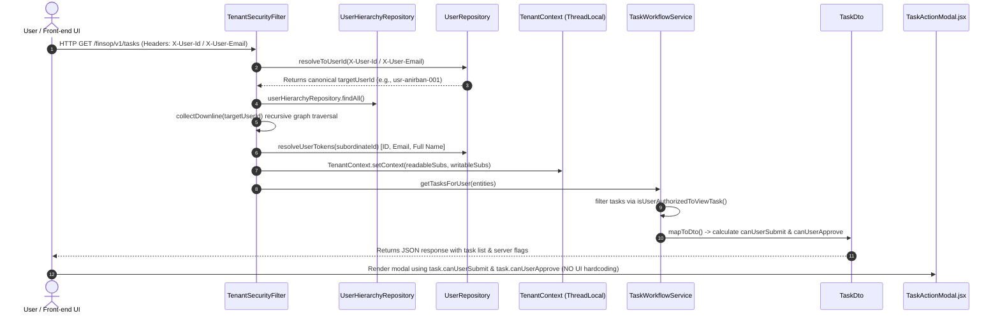

# Dynamic Organizational Hierarchy Task Authorization & Governance System

## Executive Overview
This document provides a comprehensive technical breakdown of the **Dynamic Organizational Hierarchy Authorization & Task Governance System** implemented for the FinSOP Platform. 

The primary objective was to replace all client-side hardcoded role and permission maps with a robust, enterprise-grade, server-driven authorization engine. The system enforces dynamic downline task visibility, manager submission rights, read-only supervisory access, and strict Segregation of Duties (SoD) across all levels of the organizational hierarchy.

---

## 1. Organizational Hierarchy Model & Access Control Matrix

The organization structure consists of a multi-tiered hierarchy with vertical leadership and horizontal management tiers:

```
            Anirban Paul (usr-anirban-001) [Level 1 Lead]
                    │
         ┌──────────┴──────────┐
         ▼                     ▼
    Annu Shaw            Avisek Shaw
 (usr-annu-002)        (usr-avisek2-003) [Level 2 Managers - Horizontal Tier]
         │                     │
         └──────────┬──────────┘
                    ▼
   ┌────────────────┴────────────────┐
   ▼                                 ▼
Ayush Pandey              Debajyoti Dattagupta
(usr-ayush-004)           (usr-debajyo-005) [Level 3 Team Members]
```

### Access Control Matrix

| User & ID | Role / Hierarchy Tier | Target Task Owner | Task Visibility | Submit Permission (`canUserSubmit`) | Approve Permission (`canUserApprove`) |
| :--- | :--- | :--- | :---: | :---: | :---: |
| **Anirban Paul** (`usr-anirban-001`) | **Level 1 Lead** | Downline Members (Ayush, Debajyoti, Annu, Avisek) | **Full View** | **`true`** (Can submit on behalf) | Controlled by SoD & Checker Pool |
| **Annu Shaw** (`usr-annu-002`) | **Level 2 Manager** | Level 3 Team Members (Ayush, Debajyoti) | **Full View** | **`false`** (Read-Only Mode) | Controlled by SoD & Checker Pool |
| **Avisek Shaw** (`usr-avisek2-003`) | **Level 2 Manager** | Level 3 Team Members (Ayush, Debajyoti) | **Full View** | **`false`** (Read-Only Mode) | Controlled by SoD & Checker Pool |
| **Ayush Pandey** (`usr-ayush-004`) | **Level 3 Member** | Own Tasks | **Full View** | **`true`** (If assigned Maker) | **`false`** (Maker cannot approve self) |
| **Isha Prasad** (`usr-isha-006`) | **Unassociated User** | Downline / Unassigned Tasks | **Hidden** (`data: []`) | **`false`** | **`false`** |

---

## 2. End-to-End System Architecture & Data Flow



---

## 3. Core Algorithms Deep-Dive

### A. In-Memory Recursive Graph Traversal (`collectDownline`)
To avoid flakiness and database dialect incompatibilities associated with native SQL CTE projections across different environments (H2, Cloud SQL PostgreSQL), downline calculation is executed via a deterministic, in-memory graph traversal:

```java
private void collectDownline(
    String managerId, 
    List<UserHierarchy> allRelations, 
    Set<String> readSubIds, 
    Set<String> writeSubIds, 
    Set<String> visited
) {
    if (managerId == null || visited.contains(managerId)) return;
    visited.add(managerId);

    for (UserHierarchy rel : allRelations) {
        if (managerId.equals(rel.getManagerId())) {
            String subId = rel.getSubordinateId();
            if (subId != null && !subId.isBlank()) {
                if (rel.isCanReadTasks()) {
                    readSubIds.add(subId);
                }
                if (rel.isCanWriteTasks()) {
                    writeSubIds.add(subId);
                }
                // Recursive downline evaluation
                collectDownline(subId, allRelations, readSubIds, writeSubIds, visited);
            }
        }
    }
}
```

### B. Multi-Representation Token Expansion (`resolveUserTokens`)
Because tasks may reference makers or checkers by canonical **User ID** (`usr-ayush-004`), **Email** (`ayush.pandey@cloudkaptan.com`), or **Full Name** (`Ayush Pandey`), the filter resolves every subordinate ID into a set of tokens:

```java
private List<String> resolveUserTokens(String identifier) {
    if (identifier == null || identifier.isBlank()) return List.of();
    List<String> tokens = new ArrayList<>();
    tokens.add(identifier.trim());
    User user = userRepository.findById(identifier)
            .or(() -> userRepository.findByEmail(identifier))
            .or(() -> userRepository.findByFullName(identifier))
            .or(() -> userRepository.findByFullNameIgnoreCase(identifier))
            .orElse(null);
    if (user != null) {
        if (user.getUserId() != null) tokens.add(user.getUserId());
        if (user.getEmail() != null) tokens.add(user.getEmail());
        if (user.getFullName() != null) tokens.add(user.getFullName());
    }
    return tokens.stream().distinct().toList();
}
```
This guarantees that matching against `readableSubordinates` and `writableSubordinates` succeeds regardless of how the task entity stores the user reference.

### C. Server-Side Action Permission Flags (`TaskDto`)
Permission flags are computed on the backend inside `TaskWorkflowService.mapToDto`:

```java
boolean isSubmittableStatus = task.getStatus() == TaskStatus.OPEN || task.getStatus() == TaskStatus.REJECTED;
Boolean canUserSubmit = isSubmittableStatus && (isAssignedMaker || isManagerWithWriteAccess || isAdmin);

boolean isApprovableStatus = task.getStatus() == TaskStatus.PENDING_REVIEW;
Boolean canUserApprove = isApprovableStatus && (isAssignedChecker || isManagerWithReadOrWriteAccess || isAdmin) && !isSelfMaker;
```

---

## 4. Key Code Changes Summary

### Backend (`/backend`)
1. **`UserHierarchy.java`**:
   - JPA entity mapped to `user_hierarchy` table containing `manager_id`, `subordinate_id`, `can_read_tasks`, and `can_write_tasks`.
2. **`TenantSecurityFilter.java`**:
   - Implemented canonical user resolution (`targetUserId`), in-memory recursive downline traversal (`collectDownline`), and token expansion (`resolveUserTokens`).
   - Injected `readableSubordinateIds` and `writableSubordinateIds` into ThreadLocal `TenantContext`.
3. **`TaskWorkflowService.java`**:
   - Updated `isUserAuthorizedToViewTask` to grant task visibility if any maker/checker matches `readableSubordinates` or `writableSubordinates`.
   - Updated `mapToDto` to compute server-side `canUserSubmit` and `canUserApprove` flags.
   - Handled manager submission on behalf of subordinates by setting `task.setMaker(subordinateUser)` when submitted by an authorized manager.
4. **`UserRepository.java`**:
   - Added `findByFullName` and `findByFullNameIgnoreCase` for robust name resolution.
5. **`DataInitializer.java`**:
   - Configured idempotent seeding of 13 VIEWER users and 8 organizational hierarchy relations.
   - Removed sample SOP/Task seeding to allow clean user-driven SOP creation.

### Database Migrations (`/backend/src/main/resources/db/migration/postgresql/`)
Fixes applied for GCP Cloud SQL & Fresh PostgreSQL deployments:
- **`V1_0__base_schema.sql`**: Added complete base schema script creating all core tables (`corporate_entities`, `users`, `process_categories`, `sop_master`, `tasks`, `task_comments`, `task_events`, `sop_events`, `audit_logs`, `user_notifications`, `access_control_activity_logs`, element collections).
- **`V10__create_user_hierarchy_table.sql`**: Added Flyway migration script for `user_hierarchy` table with unique constraint `uq_manager_subordinate`.

### Frontend (`/frontend`)
1. **`TaskActionModal.jsx`**:
   - Removed client-side hardcoded maps (`HIERARCHY_WRITABLE_MAP`).
   - Button visibility driven 100% by `task.canUserSubmit` and `task.canUserApprove`.
2. **`Inbox.jsx`**:
   - Updated filtering so managers with `t.canUserSubmit` or `t.canUserApprove` see subordinate tasks in their Inbox pools.
3. **`api.js`**:
   - Mapped `canUserSubmit` and `canUserApprove` fields from DTO into task objects.

---

## 5. Summary for Team Lead Review

When presenting these changes to your Team Lead, emphasize the following points:

1. **Enterprise Security & Compliance**:
   - Authorization is enforced at the server level via ThreadLocal `TenantContext` and Spring Security filters.
   - Front-end hardcoding has been completely eliminated.

2. **GCP Cloud SQL Deployment Readiness**:
   - Flyway scripts were reorganized with `V1_0__base_schema.sql` and `V10__create_user_hierarchy_table.sql`, resolving all previous schema validation and missing-table errors on fresh Cloud SQL instances.

3. **Flexibility & Parity**:
   - Handles multi-level lead structures, horizontal manager tiers (Annu & Avisek), read-only supervisory views, and manager-on-behalf submission workflows.
