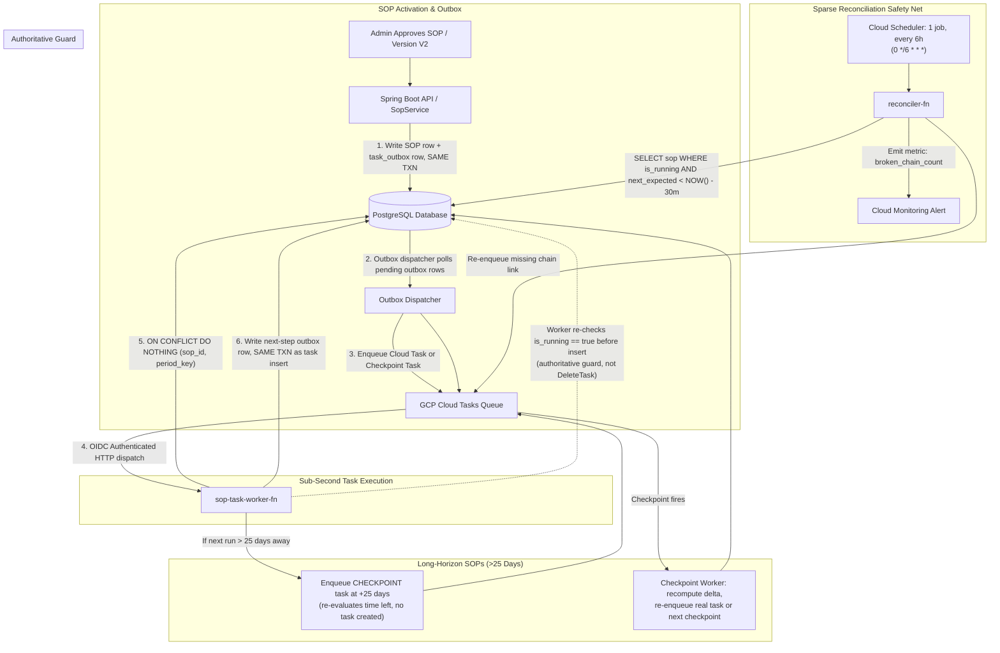

# FinSOP Enterprise Platform
### Financial Compliance & Production-Grade Hybrid SOP Task Generation Architecture (v2)

The **FinSOP Enterprise Platform** is a multi-tenant, cloud-native compliance governance platform designed for financial enterprise entities (`CK_INDIA`, `CK_US`, `CK_UK`, `CK_AUSTRALIA`). It automates Standard Operating Procedure (SOP) lifecycles, period-specific compliance task scheduling, multi-tier maker/checker workflows, evidence document verification via Google Cloud Storage (GCS), and native Row-Level Security (RLS).

---

## 1. Governance & Technical Pillars

- **Hybrid Event-Driven Architecture (v2)**: Combines Transactional Outbox pattern with GCP Cloud Tasks for sub-second precision, recursive 25-day checkpoints for long-horizon SOPs, and a 6-hourly reconciler safety net.
- **Dual-Write Consistency (Transactional Outbox)**: Outbox checkpoint records (`task_outbox`) and SOP status changes are written in the **same database transaction**, eliminating dual-write inconsistencies.
- **Solves GCP 30-Day Limit (Recursive Checkpoints)**: Enqueues 25-day checkpoint tasks for long-horizon SOPs (Quarterly, Annual), avoiding Cloud Tasks' 30-day scheduling limit.
- **Race-Free Idempotency**: Enforces `ON CONFLICT (sop_id, period_key) DO NOTHING` with client-assigned deterministic task names (`sop-{sopId}-{periodKey}`).
- **Authoritative Cancellation Guard**: Worker re-checks `is_running = true` and `version_status = 'APPROVED'` before every task insertion.
- **Zero-Drift Global Timezone Preservation**: Inherits master SOP target start time (e.g., `10:00 AM`), target due time (e.g., `05:00 PM`), and timezone offset (`+05:30`, `+00:00`, `-05:00`, `+10:00`).
- **End-to-End IAM OIDC Security**: Endpoints deployed with `--no-allow-unauthenticated`, using dedicated GCP Service Accounts (`cloud-tasks-invoker`, `cloud-scheduler-invoker`) and signed OIDC tokens.
- **Microsoft Entra ID (Azure AD) SSO**: OAuth2 / OIDC token authentication with auto-user provisioning for enterprise users.

---

## 2. System Architecture & Tech Stack

### Backend Stack
- **Framework**: Java 17, Spring Boot 3.3, Spring Security, Spring Data JPA
- **Database**: PostgreSQL with Native Row-Level Security (RLS) & Liquibase/Flyway Migrations
- **Cloud Infrastructure**: GCP Cloud Tasks, GCP Cloud Scheduler, GCP Cloud Functions (Gen2), GCP Cloud Storage (GCS)
- **Security**: IAM OIDC Token Authentication, Microsoft Entra ID (Azure AD) SSO, Row-Level Security (RLS), Segregation of Duties (SoD)

### Frontend Stack
- **Framework**: React 18, Vite 8, Tailwind CSS
- **API & Upload**: Custom REST Hooks, GCS V4 Signed URL Direct Uploader

---

## 3. Production-Grade Task Generation Architecture (v2)



---

## 4. Key Architectural Fixes & Guarantees

### A. Dual-Write Solution (Transactional Outbox)
The system avoids calling Cloud Tasks API directly inside the SOP DB write transaction. It writes an intent record into `task_outbox` in the **same database transaction**:

```sql
CREATE TABLE task_outbox (
    outbox_id UUID PRIMARY KEY DEFAULT gen_random_uuid(),
    sop_id UUID NOT NULL REFERENCES sops(sop_id),
    period_key VARCHAR(32) NOT NULL,
    schedule_time TIMESTAMPTZ NOT NULL,
    kind VARCHAR(20) NOT NULL DEFAULT 'TASK', -- 'TASK' or 'CHECKPOINT'
    dispatched_at TIMESTAMPTZ,
    dispatch_attempts INT NOT NULL DEFAULT 0,
    created_at TIMESTAMPTZ NOT NULL DEFAULT now()
);

CREATE INDEX idx_outbox_pending ON task_outbox (created_at) WHERE dispatched_at IS NULL;
```

### B. Solves GCP 30-Day Limit (Recursive 25-Day Checkpoints)
GCP Cloud Tasks caps scheduling to **30 days into the future**. For quarterly or annual SOPs:
1. If next run is >25 days away, the worker enqueues a **CHECKPOINT task at +25 days**.
2. When the checkpoint fires, it re-evaluates the remaining time:
   - If still >25 days, enqueues another 25-day checkpoint.
   - If ≤25 days, enqueues the real compliance task.

```javascript
function scheduleNext(sopId, targetTime) {
  const secondsAway = (targetTime - Date.now()) / 1000;
  const CHECKPOINT_HORIZON = 25 * 24 * 60 * 60; // Safely under GCP 30-day limit

  if (secondsAway > CHECKPOINT_HORIZON) {
    return enqueueOutboxRow(sopId, 'CHECKPOINT', addSeconds(Date.now(), CHECKPOINT_HORIZON), targetTime);
  }
  return enqueueOutboxRow(sopId, 'TASK', targetTime, null);
}
```

### C. Client-Assigned Deterministic Task Names & Race-Free Idempotency
Prevents race conditions under Cloud Tasks at-least-once delivery:
- **Database Constraint**:
  ```sql
  ALTER TABLE tasks ADD CONSTRAINT uq_sop_period UNIQUE (sop_id, period_key);
  ```
- **Atomic Insert**:
  ```sql
  INSERT INTO tasks (task_id, sop_id, record_no, period_key, status, due_date)
  VALUES ($1, $2, $3, $4, 'OPEN', $5)
  ON CONFLICT (sop_id, period_key) DO NOTHING
  RETURNING task_id;
  ```
- **Deterministic Task Naming**: `projects/${PROJECT}/locations/${LOCATION}/queues/${QUEUE}/tasks/sop-${sopId}-${periodKey}`.

### D. Sparse Reconciliation Sweeper (6-Hourly Safety Net)
1 GCP Cloud Scheduler job runs every 6 hours (`0 */6 * * *`) calling `reconciler-fn`:
```sql
SELECT sop_id, sop_code, next_expected_execution_at
FROM sop
WHERE is_running = TRUE
  AND version_status = 'APPROVED'
  AND next_expected_execution_at < NOW() - INTERVAL '30 minutes';
```
This is a sparse safety net that repairs broken chains and alerts on-call without polling the DB every minute.

---

## 5. Security & IAM Trigger Authorization

Cloud Tasks and Cloud Scheduler trigger Cloud Functions using dedicated service accounts with signed OIDC tokens:

```bash
# Dedicated Service Accounts
gcloud iam service-accounts create cloud-tasks-invoker --display-name="Invoker for sop-task-worker-fn"
gcloud iam service-accounts create cloud-scheduler-invoker --display-name="Invoker for reconciler-fn"

# Deploy Functions with Authentication Required
gcloud functions deploy sop-task-worker-fn --gen2 --no-allow-unauthenticated
gcloud functions deploy reconciler-fn --gen2 --no-allow-unauthenticated

# Grant run.invoker bindings
gcloud run services add-iam-policy-binding sop-task-worker-fn \
  --member="serviceAccount:cloud-tasks-invoker@YOUR_PROJECT.iam.gserviceaccount.com" \
  --role="roles/run.invoker"

gcloud run services add-iam-policy-binding reconciler-fn \
  --member="serviceAccount:cloud-scheduler-invoker@YOUR_PROJECT.iam.gserviceaccount.com" \
  --role="roles/run.invoker"
```

---

## 6. Cost Model @ 100k Tasks / Month

| Component | Role | Monthly Cost |
| :--- | :--- | :--- |
| **GCP Cloud Tasks** | Sub-second async task dispatch | **$0.00** (Free tier up to 1M) |
| **Worker Cloud Function** | Task execution & outbox write | **~$0.05 – $0.10** |
| **Outbox Dispatcher** | Small outbox polling worker | **~$0.00 – $0.02** |
| **Cloud Scheduler** | 1 Reconciler Job (6-hourly) | **$0.00** (Free tier up to 3 jobs) |
| **Checkpoint Hops** | Recursive hops for annual SOPs | **Negligible** |
| **Total Platform Cost** | | **~$0.05 – $0.15 / month** |

---

## 7. Local Setup & Testing

### Prerequisites
- JDK 17+
- Node.js 18+ & npm
- PostgreSQL 15+

### Backend Run
```bash
cd backend
mvn clean spring-boot:run
```

### Frontend Run
```bash
cd frontend
npm install
npm run dev
```

---

## 8. REST API Summary

| Method | Endpoint | Description |
| :--- | :--- | :--- |
| `GET` | `/finsop/v1/sops` | List SOP specifications (filtered by entity & RLS) |
| `POST` | `/finsop/v1/sops` | Create SOP specification & write outbox checkpoint |
| `POST` | `/finsop/v1/sops/{id}/action` | Approve SOP & write outbox checkpoint |
| `GET` | `/finsop/v1/tasks` | List compliance tasks with permission flags |
| `PUT` | `/finsop/v1/tasks/{id}/action` | Submit, Approve, Reject, or Permanently Reject Task |
| `POST` | `/finsop/v1/tasks/{id}/documents/generate-upload-url` | Generate GCS V4 Signed PUT URL |
| `POST` | `/finsop/v1/tasks/{id}/documents/confirm-upload` | Confirm document upload & tag SLA |
