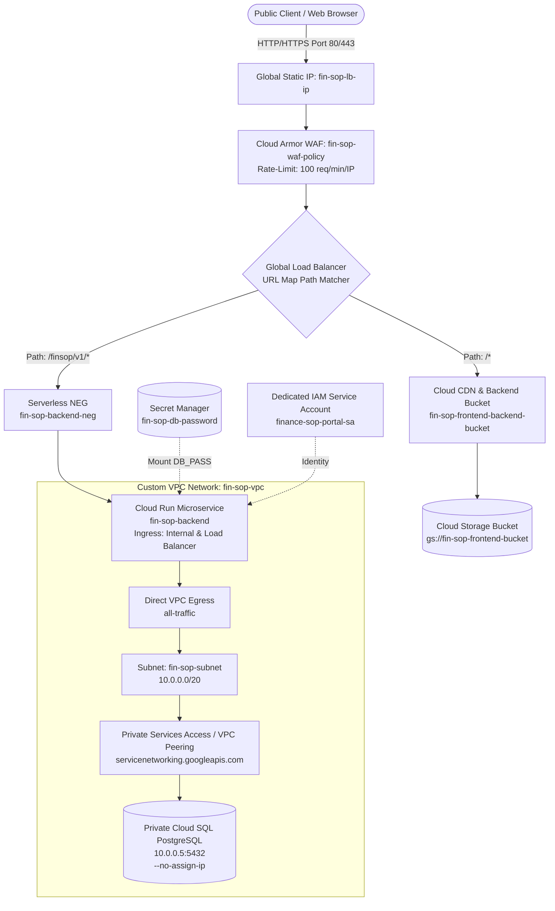

# FinSOP Portal - Complete GCP Production Deployment Guide

This document contains the complete, technical, command-by-command explanation of the Google Cloud CLI (`gcloud`) deployment commands used to deploy the **FinSOP portal**.

---

## 📄 Generated Documentation Files

We have generated and updated two files for your deployment reference:

1. **[`GCP_DEPLOYMENT_README.md`](file:///e:/Finops/GCP_DEPLOYMENT_README.md)** (Root Workspace Directory)
2. **[`docs/GCLOUD_DEPLOYMENT_GUIDE.md`](file:///e:/Finops/docs/GCLOUD_DEPLOYMENT_GUIDE.md)** (Docs Directory)

---

## 🏗️ Architectural Topology Overview



---

## 📋 Environment Prerequisites & Setup

```bash
export PROJECT_ID="finance-sop-portal"
export REGION="asia-south1"
export BUCKET_NAME="fin-sop-frontend-bucket"
export DOMAIN_NAME="finsop.cloudkaptan.com"
```

---

## Phase 1: Networking & Private Database Infrastructure

### 1. Create Custom VPC Network
```bash
gcloud compute networks create fin-sop-vpc --subnet-mode=custom
```
* **Why it is used**: Provisions a custom Virtual Private Cloud (VPC) network named `fin-sop-vpc`.
* **Parameter Breakdown**:
  * `--subnet-mode=custom`: Disables auto-creation of default subnets in all regions, enforcing explicit subnet IP range control.

### 2. Create Private Subnet
```bash
gcloud compute networks subnets create fin-sop-subnet \
    --network=fin-sop-vpc \
    --range=10.0.0.0/20 \
    --region=$REGION
```
* **Why it is used**: Creates a dedicated subnet inside `fin-sop-vpc` in region `asia-south1` (Mumbai).
* **Parameter Breakdown**:
  * `--range=10.0.0.0/20`: Allocates 4,096 internal IP addresses (`10.0.0.1` to `10.0.15.254`).

### 3. Allocate Private IP Range for Cloud SQL (VPC Peering)
```bash
gcloud compute addresses create fin-sop-db-ip-range \
    --global \
    --purpose=VPC_PEERING \
    --prefix-length=24 \
    --description="For Cloud SQL" \
    --network=fin-sop-vpc
```
* **Why it is used**: Reserves an internal IPv4 address range within the VPC for Google Private Services Connection.
* **Parameter Breakdown**:
  * `--purpose=VPC_PEERING`: Marks the IP block specifically for Service Networking.
  * `--prefix-length=24`: Allocates a `/24` subnet (256 IP addresses).

### 4. Create Private Services Access Connection
```bash
gcloud services vpc-peerings connect \
    --service=servicenetworking.googleapis.com \
    --ranges=fin-sop-db-ip-range \
    --network=fin-sop-vpc
```
* **Why it is used**: Establishes a private VPC Peering connection between your VPC and Google's internal service project where Cloud SQL resides.

### 5. Store DB Password in Secret Manager
```bash
printf "YOUR_DB_PASSWORD" | gcloud secrets create fin-sop-db-password --data-file=-
```
* **Why it is used**: Securely stores database password in Secret Manager rather than plain-text scripts.

### 6. Create Private Cloud SQL PostgreSQL Instance
```bash
gcloud sql instances create fin-sop-postgres \
    --database-version=POSTGRES_15 \
    --cpu=1 \
    --memory=4GB \
    --region=$REGION \
    --network=fin-sop-vpc \
    --no-assign-ip
```
* **Why it is used**: Provisions PostgreSQL 15 instance.
* **Security Control**:
  * `--no-assign-ip`: Removes public IP. The database is reachable **only** via internal VPC Peering.

### 7. Create Logical Database
```bash
gcloud sql databases create fin_sop_db --instance=fin-sop-postgres
```
* **Why it is used**: Creates the application database `fin_sop_db`.

### 8. Create Application DB User
```bash
gcloud sql users create sop_app_user \
    --instance=fin-sop-postgres \
    --password="YOUR_DB_PASSWORD"
```
* **Why it is used**: Provisions user credentials for Spring Boot JPA connection.

---

## Phase 2: Backend Deployment (Cloud Run)

### 1. Create Dedicated Service Account
```bash
gcloud iam service-accounts create finance-sop-portal-sa \
    --display-name="FinSOP Backend Service Account"
```
* **Why it is used**: Enforces Principle of Least Privilege for backend compute operations.

### 2. Grant Secret Manager Access
```bash
gcloud secrets add-iam-policy-binding fin-sop-db-password \
    --member="serviceAccount:finance-sop-portal-sa@${PROJECT_ID}.iam.gserviceaccount.com" \
    --role="roles/secretmanager.secretAccessor"
```
* **Why it is used**: Authorizes backend service account to read `fin-sop-db-password`.

### 3. Create Artifact Registry Repository
```bash
gcloud artifacts repositories create fin-sop-repo \
    --repository-format=docker \
    --location=$REGION
```
* **Why it is used**: Provisions private Docker repository in Artifact Registry.

### 4. Build & Push Image via Cloud Build
```bash
gcloud builds submit --tag ${REGION}-docker.pkg.dev/${PROJECT_ID}/fin-sop-repo/fin-sop-backend
```
* **Why it is used**: Compiles Spring Boot source code into a Docker image and pushes to Artifact Registry.

### 5. Deploy Microservice to Cloud Run
```bash
gcloud run deploy fin-sop-backend \
    --image=${REGION}-docker.pkg.dev/${PROJECT_ID}/fin-sop-repo/fin-sop-backend \
    --region=$REGION \
    --service-account=finance-sop-portal-sa@${PROJECT_ID}.iam.gserviceaccount.com \
    --network=fin-sop-vpc \
    --subnet=fin-sop-subnet \
    --vpc-egress=all-traffic \
    --ingress=internal-and-cloud-load-balancing \
    --no-allow-unauthenticated \
    --set-env-vars=DB_HOST=10.0.0.5,DB_PORT=5432,DB_NAME=fin_sop_db,DB_USER=sop_app_user \
    --set-secrets=DB_PASS=fin-sop-db-password:latest
```
* **Why it is used**: Runs containerized backend microservice.
* **Security & Network Breakdown**:
  * `--vpc-egress=all-traffic`: Routes outbound requests through VPC to reach private Cloud SQL (`10.0.0.5`).
  * `--ingress=internal-and-cloud-load-balancing`: Blocks direct internet access (`*.run.app`). Accepts traffic *only* via Global Load Balancer.

---

## Phase 3: Frontend Deployment (Cloud Storage)

### 1. Create Public GCS Bucket
```bash
gcloud storage buckets create gs://$BUCKET_NAME --location=$REGION
```
* **Why it is used**: Bucket for React static files.

### 2. Grant Object Viewer IAM Policy
```bash
gcloud storage buckets add-iam-policy-binding gs://$BUCKET_NAME \
    --member="allUsers" \
    --role="roles/storage.objectViewer"
```
* **Why it is used**: Allows Cloud CDN to serve public web assets.

### 3. Build & Upload React SPA
```bash
npm install
npm run build
gcloud storage cp -r dist/* gs://$BUCKET_NAME/
```
* **Why it is used**: Uploads production bundle to GCS.

---

## Phase 4: Cloud Armor WAF & Global Load Balancer Setup

### 1. Create Cloud Armor Policy
```bash
gcloud compute security-policies create fin-sop-waf-policy \
    --description="WAF security policy for FinSOP Portal"
```

### 2. Configure 100 req/min Rate Limiting Ban Rule
```bash
gcloud compute security-policies rules create 1000 \
    --security-policy=fin-sop-waf-policy \
    --expression="true" \
    --action="rate-based-ban" \
    --rate-limit-threshold-count=100 \
    --rate-limit-threshold-interval-sec=60 \
    --ban-duration-sec=300 \
    --conform-action="allow" \
    --exceed-action="deny-429" \
    --enforce-on-key="IP"
```
* **Why it is used**: Blocks IPs exceeding 100 requests per minute for 5 minutes (`429 Too Many Requests`).

### 3. Create Serverless NEG
```bash
gcloud compute network-endpoint-groups create fin-sop-backend-neg \
    --region=$REGION \
    --network-endpoint-type=serverless \
    --cloud-run-service=fin-sop-backend
```

### 4. Create Backend Service & Attach WAF / NEG
```bash
gcloud compute backend-services create fin-sop-backend-service \
    --global \
    --load-balancing-scheme=EXTERNAL_MANAGED

gcloud compute backend-services update fin-sop-backend-service \
    --global \
    --security-policy=fin-sop-waf-policy

gcloud compute backend-services add-backend fin-sop-backend-service \
    --global \
    --network-endpoint-group=fin-sop-backend-neg \
    --network-endpoint-group-region=$REGION
```

### 5. Create Backend Bucket & Enable Cloud CDN
```bash
gcloud compute backend-buckets create fin-sop-frontend-backend-bucket \
    --gcs-bucket-name=$BUCKET_NAME \
    --enable-cdn
```

### 6. Create URL Map for Path Routing
```bash
gcloud compute url-maps create fin-sop-load-balancer \
    --default-backend-bucket=fin-sop-frontend-backend-bucket

gcloud compute url-maps add-path-matcher fin-sop-load-balancer \
    --path-matcher-name=api-matcher \
    --default-backend-bucket=fin-sop-frontend-backend-bucket \
    --backend-service-path-rules="/finsop/v1/*=fin-sop-backend-service"
```
* **Path Routing**: `/*` to Cloud CDN Frontend, `/finsop/v1/*` to Cloud Run.

### 7. Reserve Global Public IP
```bash
gcloud compute addresses create fin-sop-lb-ip --global
```

### 8. Configure HTTP Proxy & Port 80 Forwarding Rule
```bash
gcloud compute target-http-proxies create fin-sop-http-proxy \
    --url-map=fin-sop-load-balancer

gcloud compute forwarding-rules create fin-sop-http-forwarding-rule \
    --global \
    --target-http-proxy=fin-sop-http-proxy \
    --ports=80 \
    --address=fin-sop-lb-ip
```

### 9. Grant Cloud Run Invoker IAM Permission
```bash
gcloud run services add-iam-policy-binding fin-sop-backend \
    --region=$REGION \
    --member="allUsers" \
    --role="roles/run.invoker"
```

---

## Phase 5: Custom Domain & Managed HTTPS Setup

### 1. Create Managed SSL Certificate
```bash
gcloud compute ssl-certificates create fin-sop-ssl-cert \
    --domains=$DOMAIN_NAME \
    --global
```

### 2. Create Target HTTPS Proxy
```bash
gcloud compute target-https-proxies create fin-sop-https-proxy \
    --url-map=fin-sop-load-balancer \
    --ssl-certificates=fin-sop-ssl-cert \
    --global
```

### 3. Create Port 443 Forwarding Rule
```bash
gcloud compute forwarding-rules create fin-sop-https-forwarding-rule \
    --global \
    --target-https-proxy=fin-sop-https-proxy \
    --ports=443 \
    --address=fin-sop-lb-ip
```
